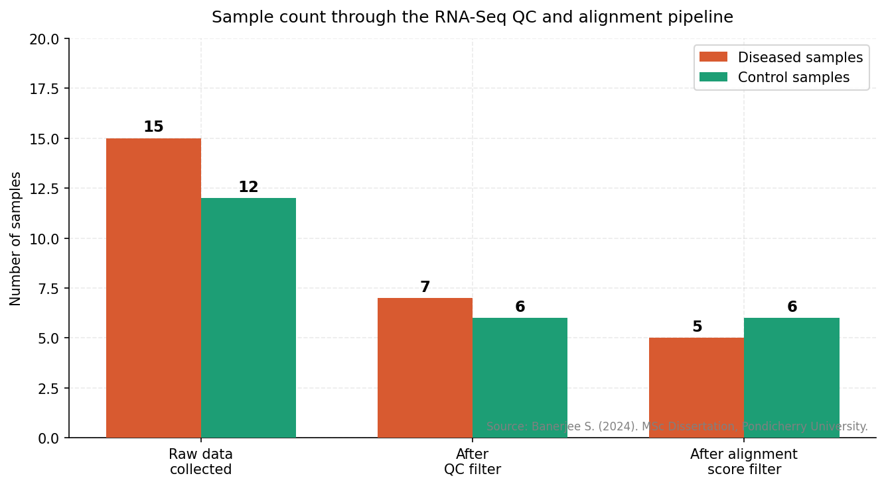
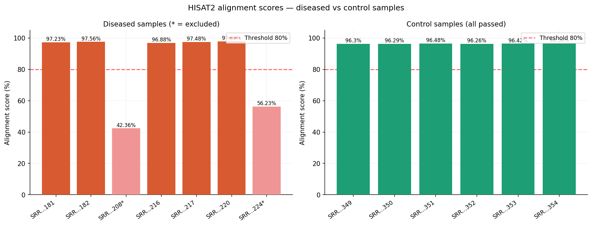
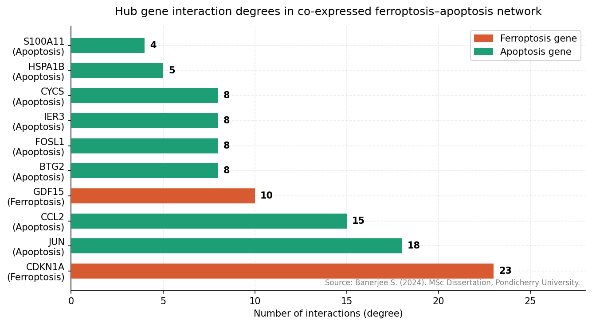
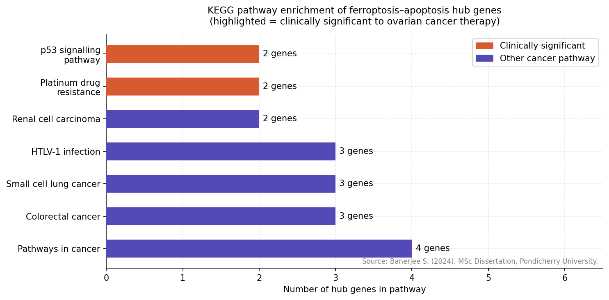
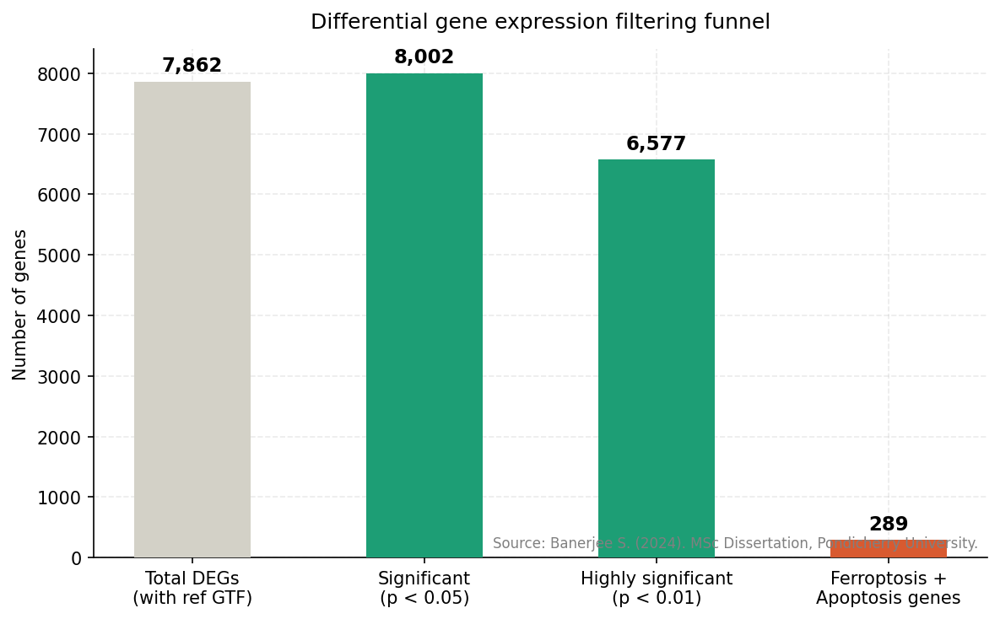
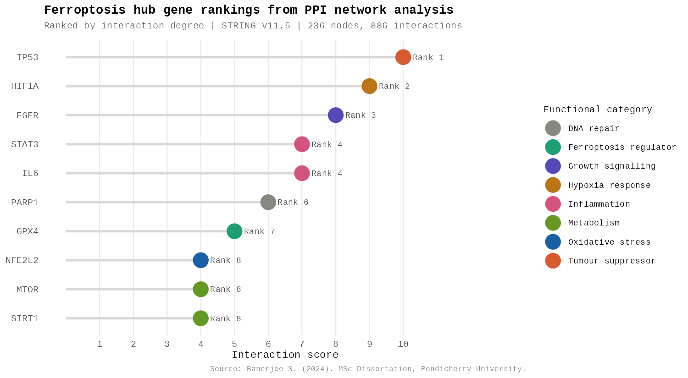
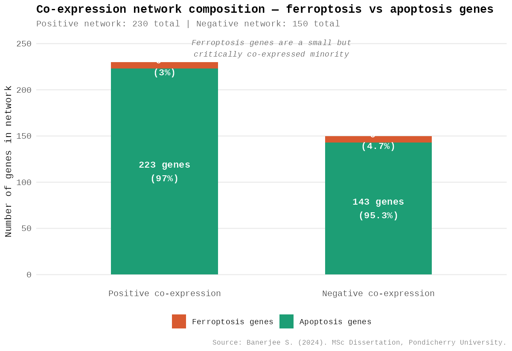
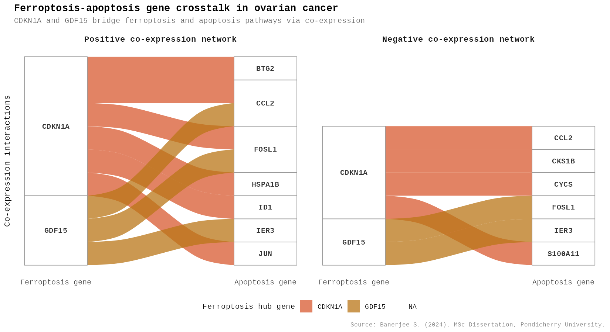

# Ferroptosis Hub Genes & Apoptosis in Ovarian Cancer
### MSc Bioinformatics Dissertation | Pondicherry University | May 2024

**Author:** Shruti Banerjee (Reg. No. 22378042)  
**Supervisor:** Dr. Basant K. Tiwary, Professor, Department of Bioinformatics  
**Degree:** Master of Science in Bioinformatics  

---

## Overview

Ovarian cancer has one of the highest mortality rates among gynaecological malignancies, largely due to late-stage diagnosis and resistance to standard chemotherapy. This study investigates the molecular crosstalk between two distinct cell death pathways — **ferroptosis** and **apoptosis** — to identify potential therapeutic targets in ovarian cancer.

**Key finding:** From 7,862 differentially expressed genes, two critical ferroptosis hub genes — **CDKN1A** and **GDF15** — were identified as co-expressed with apoptosis genes and associated with multiple carcinogenic pathways including platinum drug resistance.

---

## Repository Structure

```
ferroptosis-ovarian-cancer-analysis/
├── README.md
├── METHODS.md
├── requirements.txt
├── thesis_shruti_banerjee.pdf
├── thesis_visualizations_fixed.py
├── thesis_visualizations.R
├── figure/
│   ├── chart1_qc_pipeline.png
│   ├── chart2_alignment_scores.png
│   ├── chart3_hub_gene_degrees.png
│   ├── chart4_kegg_pathways.png
│   ├── chart5_deg_funnel.png
│   ├── R_chart1_lollipop_hub_ranks.png
│   ├── R_chart2_coexpression_balance.png
│   └── R_chart3_gene_crosstalk.png
├── notebooks/
│   └── ferroptosis_analysis.ipynb
└── data/
    └── sample_ids.csv
```

---

## Pipeline Overview

```
Raw RNA-Seq Data (ENA SRA)
        ↓
Quality Control (FastQC + Trimmomatic)
        ↓
Alignment to Reference Genome (HISAT2)
        ↓
Transcriptome Assembly (StringTie)
        ↓
Differential Gene Expression (DESeq2 in R)
        ↓
PPI Network Construction (STRING + Cytoscape)
        ↓
Gene Co-expression Network (PSYCH package in R)
        ↓
Functional Enrichment Analysis (DAVID / KEGG)
        ↓
Hub Gene Identification → CDKN1A & GDF15
```

---

## Dataset

| Parameter | Diseased Samples | Control Samples |
|---|---|---|
| Bioproject | PRJNA1005317 | PRJNA578440 |
| Organism | *Homo sapiens* | *Homo sapiens* |
| Assay type | RNA-Seq | RNA-Seq |
| Platform | Illumina HiSeq 300 | Illumina HiSeq 300 |
| Samples after QC | 5 | 6 |
| Alignment score | 95–98% | 96–97% |

---

## Tools & Technologies

**Bioinformatics Pipeline**


**Statistical Analysis & Visualisation**


**Network Analysis**


**Databases**


---

## Results

### 1. Differential Gene Expression

| Filter | Gene Count |
|---|---|
| Total DEGs identified | 7,862 |
| Significant (p < 0.05) | 8,002 |
| Highly significant (p < 0.01) | 6,577 |
| Ferroptosis + Apoptosis genes filtered | 289 |

### 2. PPI Network Statistics

| Network | Nodes | Interactions |
|---|---|---|
| All DEGs | 236 | 886 |
| Ferroptosis genes | 174 | 1,469 |
| Co-expressed hub genes | 12 | 25 |

### 3. Ferroptosis Hub Gene Rankings

| Rank | Gene | Functional Category |
|---|---|---|
| 1 | TP53 | Tumour suppressor |
| 2 | HIF1A | Hypoxia response |
| 3 | EGFR | Growth signalling |
| 4 | IL6 | Inflammation |
| 4 | STAT3 | Inflammation |
| 6 | PARP1 | DNA repair |
| 7 | GPX4 | Ferroptosis regulator |
| 8 | SIRT1 | Metabolism |
| 8 | MTOR | Metabolism |
| 8 | NFE2L2 | Oxidative stress |

### 4. Co-expressed Ferroptosis–Apoptosis Hub Genes

| Gene | Type | Interactions | Role |
|---|---|---|---|
| **CDKN1A (p21)** | Ferroptosis | 23 | Cell cycle arrest; tumour suppressor; p53 mediator |
| **GDF15** | Ferroptosis | 10 | Stress-induced cytokine; cancer progression |
| CISD2 | Ferroptosis | — | Iron-sulphur cluster; mitochondrial function |
| NUPR1 | Ferroptosis | — | Stress response; ferroptosis resistance |

### 5. KEGG Pathway Enrichment

| Pathway | Key Genes |
|---|---|
| Pathways in cancer | CDKN1A, JUN, CYCS, CKS1B |
| Colorectal cancer | CDKN1A, JUN, CYCS |
| Small cell lung cancer | CDKN1A, CYCS, CKS1B |
| Renal cell carcinoma | CDKN1A, JUN |
| **Platinum drug resistance** | **CDKN1A, CYCS** |
| **p53 signalling pathway** | **CDKN1A, CYCS** |
| HTLV-1 infection | FOSL1, CDKN1A, JUN |

---

## Data Visualisations

All charts are fully reproducible. Source code in both Python and R.

### Python Visualisations
*Generated using Matplotlib + NumPy — see [`thesis_visualizations_fixed.py`](./thesis_visualizations_fixed.py)*

#### Sample count through QC pipeline


#### HISAT2 alignment scores — diseased vs control


#### Hub gene interaction degrees


#### KEGG pathway gene involvement


#### DEG filtering funnel


---

### R Visualisations
*Generated using ggplot2 + ggalluvial — see [`thesis_visualizations.R`](./thesis_visualizations.R)*

#### Ferroptosis hub gene rankings — lollipop chart
> Publication-quality lollipop chart colour-coded by functional category.



#### Co-expression network composition — ferroptosis vs apoptosis
> Shows that ferroptosis genes are a small but critically co-expressed minority.



#### Ferroptosis–apoptosis gene crosstalk — alluvial diagram
> Sankey-style diagram showing CDKN1A and GDF15 bridging ferroptosis and apoptosis pathways.



---

## How to Reproduce

**Python:**
```bash
pip install -r requirements.txt
python thesis_visualizations_fixed.py
```

**R:**
```r
install.packages(c("ggplot2", "ggalluvial", "dplyr"))
Rscript thesis_visualizations.R
```

**In Google Colab (R):**
```python
!apt-get install -y r-base libcurl4-openssl-dev libssl-dev libxml2-dev
!R -e "install.packages(c('ggplot2','ggalluvial','dplyr'), repos='http://cran.r-project.org')"
!Rscript thesis_visualizations.R
```

---

## Key Biological Insights

- **Platinum drug resistance:** CDKN1A's involvement suggests ferroptosis induction could resensitise cisplatin-resistant ovarian tumours — a major clinical challenge.
- **GPX4** (rank 7) is the primary ferroptosis gatekeeper and a promising therapeutic target in ovarian cancer.
- The **p53–CDKN1A axis** is a shared regulatory node between ferroptosis and apoptosis — making it a dual-pathway therapeutic target.
- The alluvial diagram reveals CDKN1A has broader apoptosis connectivity than GDF15, suggesting it plays a more central bridging role.

---

## Conclusion

This study identified **CDKN1A and GDF15** as key ferroptosis hub genes with co-regulatory roles in apoptosis in ovarian cancer. Their involvement in platinum drug resistance and p53 signalling opens avenues for combination therapies targeting both cell death mechanisms simultaneously.

---

## Citation

Banerjee, S. (2024). *Identification of ferroptosis-related hub genes and their potential relation with apoptosis in Ovarian Cancer.* MSc Dissertation, Department of Bioinformatics, Pondicherry University.

---

**Shruti Banerjee** · banerjee.shruti1306@gmail.com · [GitHub](https://github.com/shruti-banerjee)
